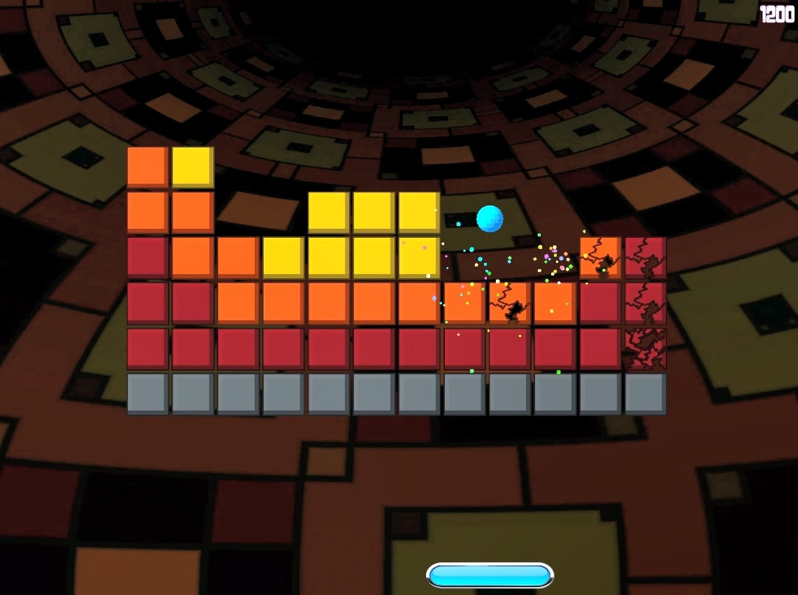

# Parcanoid

This small arcade game was made for Udemy's [Complete C# Unity Game Developer 2D](https://www.udemy.com/course/unitycourse/) course, created by Ben Tristem, Rick Davidson, and GameDev.tv Team. It is a 2D block breaker game, developed in C# and Unity.

The purpose of the game is to break all the blocks in each level without letting the ball fall. The player only uses the mouse to start and exit the application from the main menu, and to also control the paddle after the game starts.

## Project Details

This game was developed according to the instructions given in the course and is very similar to the one created by the instructors. The majority of the files were automatically generated by the Unity Engine, and the original code for the game can be found in `Assets/Scripts/`.

The project includes features such as the following:
* Prefabs, tags, and scenes
* UI elements and events
* Sound and visual effects
* World units and 2D vectors
* Rigidbodies and colliders 
* Gravity and physics materials
* Instantiating and destroying objects
* Implementing the Singleton Pattern for persistent data
* An autoplay option for playtesting
* Various other Unity features, such as `Time.timeScale` to change the speed of the game, `GetComponent` and `FindObjectOfType` to search for references dynamically, and `Random.Range` to generate random numbers.